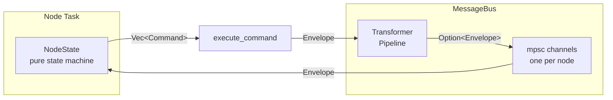
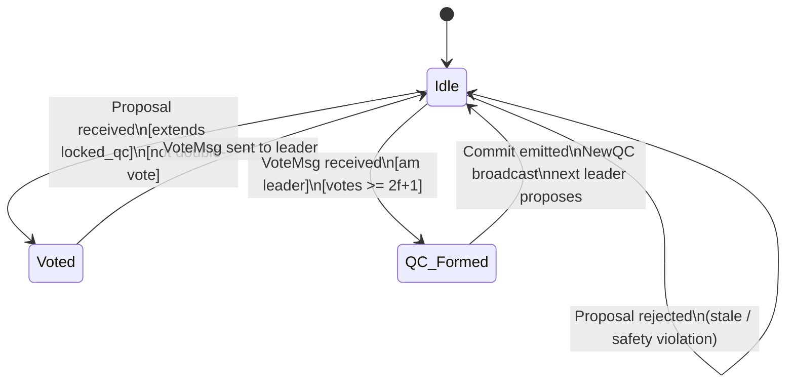
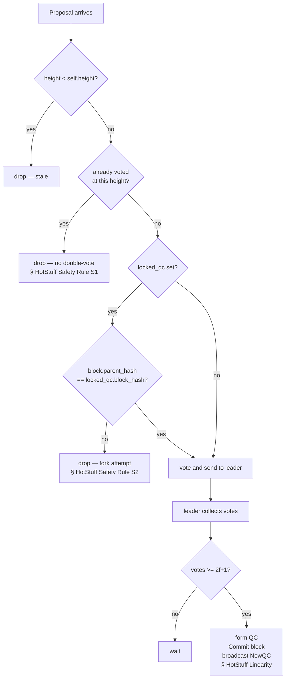
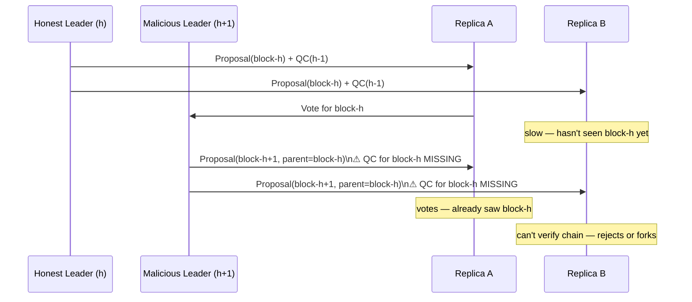

# consensus-simulation

A 4-node BFT consensus simulation in Rust, built for learning.
Implements Pipelined HotStuff step-by-step, then reproduces and fixes the MonadBFT tailfork attack.

**Spec:** [HotStuff: BFT Consensus with Linearity and Responsiveness](https://arxiv.org/abs/1803.05069) — Abraham, Malkhi et al. (2018)

---

## Architecture

### Message flow



### NodeState — pure state machine

Every node is a plain struct with no I/O. `handle(msg) -> Vec<Command>` is the only entry point.



### HotStuff safety rules (where each invariant lives in the code)



---

## Parameters

| Symbol | Value | Meaning |
|--------|-------|---------|
| `n` | 4 | total nodes |
| `f` | 1 | max byzantine faults `= floor((n-1)/3)` |
| quorum | 3 | votes needed for QC `= 2f+1` |

---

## Progress

### Stages complete

| Stage | What | Key Rust concepts |
|-------|------|-------------------|
| 1 | `types.rs` — `Block`, `Vote`, `QC`, `Message`, `Envelope`, `Command` | newtype pattern, `derive`, `[u8;32]` hashing |
| 2 | `node.rs` — `NodeState` pure state machine, 4 unit tests | ownership, `HashSet`/`HashMap`, borrow scoping |
| 3 | `bus.rs`, `runner.rs`, `transformer.rs` — async wiring | `Arc`, `tokio::mpsc`, `broadcast`, `select!` |
| 4 | `DropTransformer` + round-robin rotation + `NewQC` propagation | trait objects, `Box<dyn Trait>` |

### Stages remaining

| Stage | What |
|-------|------|
| 5 | `TimeoutMsg` handling — view-change when leader is offline |
| 6 | `DelayTransformer` — slow network, timing edge cases |
| 7 | `TailForkTransformer` — reproduce the MonadBFT attack |
| 8 | MonadBFT fix — `block.justify` QC field + proposal validation |

---

## The MonadBFT goal

### The tailfork attack (Stage 7)

In pipelined HotStuff, a leader at height `h` is supposed to embed a QC for block `h-1` in their proposal, proving the previous block is safely certified. The attack:



### The fix (Stage 8)

One rule added to `handle_proposal` in `node.rs`:

```rust
// MonadBFT: proposal must include a valid QC for its parent.
// Without this, a malicious leader can fork the tail of the chain.
if !block.justify_is_valid() {
    return vec![]; // reject
}
```

This requires adding `justify: QuorumCertificate` to `Block`. A proposer must prove the previous block reached quorum before anyone will extend the chain. The tailfork becomes impossible: no valid QC → no votes → no extension.

---

## Development

### Run

```bash
cargo run
```

Output shows two scenarios: all nodes online, then node 4 offline (fault tolerance demo).

### Test

```bash
cargo test
```

### Lint (Clippy)

```bash
# Lint with warnings
cargo clippy

# Fail on any warning (use before committing)
cargo clippy -- -D warnings

# Auto-fix what it can
cargo clippy --fix
```

Lint rules configured in `Cargo.toml` under `[lints.clippy]`.
